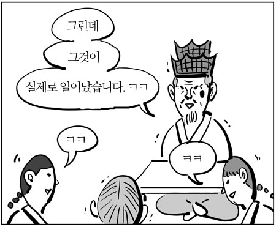

# snipHer

- TA : SeongIl Wi
- Seungyeop Lee

---

### Her Messenger is back


---

### ..with More Security!!


- Security Enhanced Her Messenger

- 더욱 안전해 더더욱 믿고 쓰는 SEHer 메신저

---

### Enhanced Security

- 암호화시 Fingerprint 사용 : Key ID 사용으로 인한 충돌 방지

- Public Key와 Fingerprint 검증 : 검증되지 않은 사용자 거절

---

### Fingerprint?


---

#### Happy Hacking? Nah.
### Happy Secure Messaging!
#### with SEHer Messenger

---

### ...not anymore.


---

### snipHer
- Automated Sniffing
- Stealthy Sniffing
- Anonymous Sniffing  

#### <p>how is it possible?

---

### SEHer's Encryption Scheme

```
$ gpg --encrypt -r "recipient"
```
---

### But What If?
```
$ gpg --encrypt -r "recipient" -r "attacker"
```

---



---

### "Key Protocol"

- SEHer protocol to inform login/logout to others
- Also, used for public key exchange
- and the Fingerprint

---

### Verify Received Fingerprint

Valid and Correct Fingerprint?

---

### Fingerprint Length?

```c++
if(fpr.length() != 40) {
	return false;
}
```

---

### Fingerprint match Public Key?

```c++
if(!VerifyFprAndPubkey(fpr, keyid)) {
    return false;
}
```

---

### Fingerprint match Public Key?
<div style="text-align:left;">
<h4> Use gpg's output</h4>
</div>

```shell
$ gpg --import pubkey.pub
gpg: key D9595B48: public key "githubB" imported
gpg: Total number processed: 1
gpg:               imported: 1  (RSA: 1)
```

@[2]
#### Returns "Short Key ID"

---

### Fingerprint match Public Key?
<div style="text-align:left;">
<h4> Compare Key ID vs. Fingerprint</h4>
</div>

```c++
// compare short key id and fingerprint
// short key id length : 8
// fingerprint length : 40

if(importedKeyID.compare(recvedFpr.substr(32,8)) != 0) {
	return false;
}
return true;
```

---

### Fingerprint match Public Key?
<div style="text-align:left;">
<h4>Compare Key ID vs. Fingerprint</h4>
</div>


---

### But What If...??


---


---

### Verify Received Key Protocol

Really sent by the "Sender" ??

```json
{
	Type : Key Protocol
	Sender : Seungyeop Lee
	Public Key : 177CM
	Fingerprint : BEEFBEEF...(40 byte)
}
```

@[2]

---

### ...Oops!


---

### Logic Errors

- gpg also accepts "Key ID" for --recipient
- SEHer does not verify entire Fingerprint
- SEHer doen't care about the **real** sender

---

### Attack

공격자의 Key ID를 사용자들의 Fingerprint에 주입
공격자는 Onion Routing 중간에서 메시지 복호화 가능

---

### Attack
* Automated
 * 기존 사용자들 뿐만 아니라 새로운 사용자들의 Fingerprint도 변조
* Stealthy
 * 공격자도 Onion Routing에서 relay 기능은 충실히 수행
* Anonymous
 * 공격자가 실제 사용하는 키 대신 dummy 키 사용

---

### SEHer


---

### snipHer


---

### snipHer


---

### Demo

+++

### Demo Backup Slides..

+++

### Demo Backup Slides..

---

### snipHer


---

### Demo

+++

### Demo Backup Slides..

+++

### Demo Backup Slides..

---

### Thank you

#### Questions are welcomed

