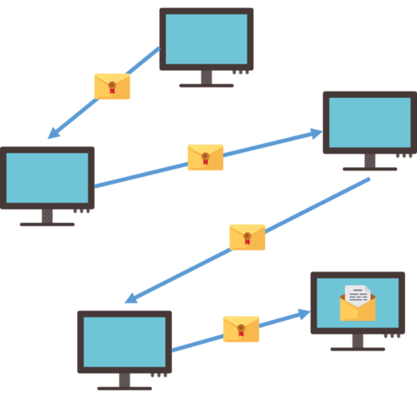

# snipHer

- TA : SeongIl Wi
- Seungyeop Lee

---

### Her Messenger is back


Note: We have a good news today. Team 3's Her Messenger is Back!!
---

### ..with More Security!!


- Security Enhanced Her Messenger

- 더욱 안전해 더더욱 믿고 쓰는 SEHer 메신저

Note: With More Security. Security Enhanced Her Messenger, or SEHer Messenger is released.
---

### Enhanced Security

- 암호화시 Fingerprint 사용 : Key ID 사용으로 인한 충돌 방지

- Public Key와 Fingerprint 검증 : 검증되지 않은 사용자 거절

Note: SEHer uses fingerprint instead of key id or recipient's name in encryption. Also, it verifies the fingerprint.
---

### Fingerprint?


Note: What is fingerprint? As some of you may know, fingerprint is a 20 byte unique ID for a pgp key. Key id is a portion of the fingerprint. There are two kinds of key id, long key id and short key id.
---

#### Happy Hacking? Nah.
### Happy Secure Messaging!
#### with SEHer Messenger

Note: You were able to enjoy Secure Messaging with SEHer Messenger!
---

### ...not anymore.


Note: But not anymore.
---

### snipHer
- Automated Sniffing
- Stealthy Sniffing
- Anonymous Sniffing  

#### <p>how is it possible?

Note: That's because of snipHer, the Her Messenger Sniffer. It allows automated, stealthy and anonymous sniffing of the messages.
---

### SEHer's Encryption Scheme

```
$ gpg --encrypt -r "recipient"
```

Note: SEHer encrypts messages with that command.
---

### But What If?
```
$ gpg --encrypt -r "recipient" -r "attacker"
```

Note: But What if something like this was done? Then the attacker will be able to decrypt the message.
---


Note: And it really happened.
---

### "Key Protocol"

- SEHer protocol to inform login/logout to others
- Also, used for public key exchange
- and the Fingerprint

Note: The "Key protocol" is a protocol used by SEHer Messenger to inform of a user's login/logout to other users. Also, it is used for public key and fingerprint exchange.
---

### Verify Received Fingerprint

Valid and Correct Fingerprint?

Note: If SEHer messenger receives key protocol, it validates the fingerprint
---

### Fingerprint Length?

```c++
if(fpr.length() != 40) {
	return false;
}
```

Note: It checks key length,
---

### Fingerprint match Public Key?

```c++
if(!VerifyFprAndPubkey(fpr, keyid)) {
    return false;
}
```

Note: And it also verify received fingerprint with imported key's key id
---

### Fingerprint match Public Key?
<div style="text-align:left;">
<h4> Use gpg's output</h4>
</div>

```shell
$ gpg --import pubkey.pub
gpg: key D9595B48: public key "githubB" imported
gpg: Total number processed: 1
gpg:               imported: 1  (RSA: 1)
```

@[2]
#### Returns "Short Key ID"

Note: When SEHer imports a key, gpg will return output like above. It contains Short Key ID.
---

### Fingerprint match Public Key?
<div style="text-align:left;">
<h4> Compare Key ID vs. Fingerprint</h4>
</div>

```c++
// compare short key id and fingerprint
// short key id length : 8
// fingerprint length : 40

if(importedKeyID.compare(recvedFpr.substr(32,8)) != 0) {
	return false;
}
return true;
```

Note: To compare key id with fingerprint, SEHer will use only a portion of the fingerprint. This is the point of SEHer's logic error 
---

### Fingerprint match Public Key?
<div style="text-align:left;">
<h4>Compare Key ID vs. Fingerprint</h4>
</div>


Note: So SEHer messenger verifies key and fingerprint like this
---

### But What If...??


Note: But what if??
---


---

### Verify Received Key Protocol

Really sent by the "Sender" ??

```json
{
	"Type" : "Key Protocol"
	"Sender" : "Seungyeop Lee"
	"Public Key" : "177cm"
	"Fingerprint" : "BEEFBEEF...(40 byte)"
}
```

@[3]

Note: Verifying the sender is important. Let's see how SEHer messenger does it.
---

### ...Oops!


---

### Logic Errors

- gpg also accepts "Key ID" for --recipient
- SEHer does not verify entire Fingerprint
- SEHer doesn't care about the **real** sender

Note: So the logic errors are in public key and finperprint exchanging scheme
---

### Attack

- 공격자 소유의 Key ID를 사용자들의 Fingerprint에 주입
- 공격자는 Onion Routing 중간에서 메시지 복호화 가능

Note:
---

### Attack
* Automated Sniffing
 * 기존 사용자들 뿐만 아니라 새로운 사용자들의 Fingerprint도 변조
* Stealthy Sniffing
 * 공격자도 Onion Routing에서 relay 기능은 충실히 수행
* Anonymous Sniffing
 * 공격자가 실제 사용하는 키 대신 dummy 키 사용

---

### SEHer



---

### snipHer


---

### snipHer


---

### Demo

+++

### Demo Backup Slides..

+++

### Demo Backup Slides..

---

### snipHer


---

### Thank you

#### Questions are welcomed

