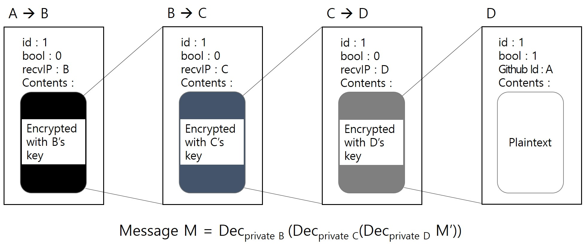

# HER Messenger - Team3


### Abstract
- PGP를 이용한 암호화 메신저
- OnionRouting으로 중간단계에서 발신자, 수신자 익명화

### Protocol Design

| Type   | Message Protocol | Key Protocol |
|--------|------------------|--------------|
| int    | if ID = 1, Msg Protocol |if ID = 0, Key Protocol|
| bool   |                  |              |
| string |                  |              |
| string |                  |              |

### OnionRouting
- ex) Message 전송순서 : A -> B -> C -> D


### Installation
- 컴파일을 위한 패키지 설치
```
$ sudo apt-get install g++
$ sudo apt-get install make
$ sudo apt-get install qt4-qmake
$ sudo apt-get install libncurses-dev
```
- 패키지 설치 이후
```
$ git clone https://github.com/KAIST-IS521/2018s-onion-team3.git
$ curl -fsSL https://get.docker.com/ | sudo sh
$ cd ..  
# ./AutoDocker.sh
```

### Usages
```
# ./startMessenger.sh
# ./setup.sh
# cd onionMessenger
# ./onionMessenger [github ID] [PassPhrase]
Done!
```

### Examples
- githubA user
```
# ./onionMessenger/onionMessenger githubA ???????
██╗  ██╗███████╗██████╗
██║  ██║██╔════╝██╔══██╗  
███████║█████╗  ██████╔╝  
██╔══██║██╔══╝  ██╔══██╗  
██║  ██║███████╗██║  ██║  
╚═╝  ╚═╝╚══════╝╚═╝  ╚═╝  
1. List
2. Talk
3. Exit
> 1  
 === Your List! ===
githubB : 172.17.0.2
 ==== Done! ====

1. List
2. Talk
3. Exit
> 2
                             ┌────────────────────────────┐                             
                             │ githubB                    │                             
                             │                            │                             
                             │                            │                             
                             │                            │                             
                             │                            │                             
                             │                            │                             
                             │                            │                             
                             │                            │                             
                             └────────────────────────────┘                             
Her                                                                                      
Me: hi                                                                                   
githubB: Hello                                                                           
Me: I am githubA                                                                         
githubB: i am github B~                                                                  
```

- github user
```
# ./onionMessenger/onionMessenger githubB ???????
██╗  ██╗███████╗██████╗
██║  ██║██╔════╝██╔══██╗
███████║█████╗  ██████╔╝
██╔══██║██╔══╝  ██╔══██╗
██║  ██║███████╗██║  ██║
╚═╝  ╚═╝╚══════╝╚═╝  ╚═╝
1. List
2. Talk
3. Exit
> 1
 === Your List! ===
githubA : 172.17.0.3
 ==== Done! ====

1. List
2. Talk
3. Exit
> 2

                             ┌────────────────────────────┐                             
                             │ githubA                    │                             
                             │                            │                             
                             │                            │                             
                             │                            │                             
                             │                            │                             
                             │                            │                             
                             │                            │                             
                             │                            │                             
                             └────────────────────────────┘                             

Her
githubA: hi
Me: Hello
githubA: I am githubA
Me: i am github B~
```

### Environment
- Git issue와 milestone을 사용하여 편한 의사소통 및 협업 가능
- JSON을 사용하여 빠르고 편한 파싱 및 헤더 구성
- ncurses를 이용한 보기 좋은 TUI환경 구성
- Qt Creator를 사용하여 Makefile의 자동 생성 및 편한 개발환경 구축


### Team member

| Team member     | Position | Assignment |
|:---------------:|:--------:|------------|
|  SeongIl Wi     |    TA    | Advice |
|  DongHyeon Oh   |   팀장   |HER messenger 개발 총괄|
|  SeungYeop Lee  |   팀원   |HER messenger 개발|
|  NakJun Choi    |   팀원   |PITCHME.md 작성, 홍보영상 편집, Presentation|
|  SeJin Jeong    |   팀원   |Sockthread.cpp 함수 개발, README.md 작성 |

### Insight

### Reference
 - https://github.com/nlohmann/json
