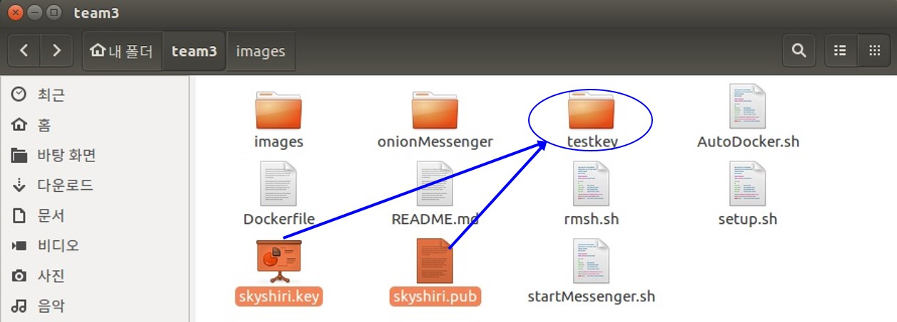

# HER Messenger - Team3

### HER messenger
- 빠르고 안전해 믿고 쓰는 HER 메신저!

### Abstract
- PGP를 이용한 암호화된 메시지 송/수신
- OnionRouting으로 중간단계에서 발신자, 수신자 익명화
- 메신저 송/수신 경로 random 지정으로 익명성 강화
- Docker에 생소한 사용자의 편의성 강화

### Protocol Design

| Field   | Message Protocol | Key Protocol |
|--------|------------------|--------------|
| id     | id=1 : 메시지 | id=0 : Key |
| bullian| bool? 전달 : 내 메시지 | bool? 로그인:로그아웃 |
| sendIP|  sender IP(마지막 메시지)       | sender IP        |
| recvIP | receiver IP     | receiver IP             |
| githubID | sender id(마지막 메시지)  | sender id |
| content| 암호화된 메시지 | sender Public Key |

* 메시지를 JSON 형식으로 만들어 전송  
  - 전송 중간 단계 메시지 example
`{"id":"1", "bullian":"0","sendIP" : "", "recvip":"172.17.0.3","githubID":"","content":"<Encrypted Message>"}`
  - 전송 마지막 단계 메시지 example
`{"id":"1","bullian":"1","sendIP" : "172.17.0.5","recvip":"172.17.0.3","githubID":"skyshiri","content":"Plantext Message"}`
  - Key 전송 example
`{"id":"0", "bullian":"1","sendIP" : "172.17.0.4", "recvip":"172.17.0.3","githubID":"skyshiri","content":"<PGP Public key>"}`
  - Deauthentication example
`{"id":"0", "bullian":"0","sendIP" : "172.17.0.4", "recvip":"172.17.0.3","githubID":"skyshiri","content":"<PGP Public key>"}`

### OnionRouting
- 메시지는 최대 5단계의 random path로 전송
- 중간단계 송신자는 메시지 암호화로 내용 파악이 불가함   
- Message 전송순서가 A -> B -> C -> D 일 경우 OnionRouting은 다음과 같이 진행된다.
  - 그림에서 B와 C는 A가 보낸 메시지를 알 수 없으며, 오직 D만 A가 보낸 메시지 내용 파악 가능        

    

### Installation
```
$ : 현재 사용자의 명령 대기  
# : 슈퍼 유저의 명령 대기
```
- 프로그램 파일 설치
```
$ git clone https://github.com/KAIST-IS521/2018s-onion-team3.git
$ curl -fsSL https://get.docker.com/ | sudo sh
$ cd 2018s-onion-team3  
$ gpg --armor --export [githubID] > [githubID].pub
$ gpg --export-secret-keys -a [githubID] > [githubID].key
```
- 메신저 암호화를 위한 본인 Key 설정
   - testkey 폴더에 [Your id].key와 [Your id].pub를 넣어주기


```
# ./AutoDocker.sh
```

### Usages
- ./startMessenger.sh를 터미널 창에 입력하고,ID와 passphrase를 입력하면
메신저에 접속된다.
```
#./startMessenger.sh
Your Github ID :[YOUR id]
Your passphrase :[YOUR passphrase]
██╗  ██╗███████╗██████╗
██║  ██║██╔════╝██╔══██╗
███████║█████╗  ██████╔╝
██╔══██║██╔══╝  ██╔══██╗
██║  ██║███████╗██║  ██║
╚═╝  ╚═╝╚══════╝╚═╝  ╚═╝
1. List
2. Talk
3. Exit
```

- List
  - 숫자 '1'을 터미널 창에 입력하면 채팅할 수 있는 상대방의 ID와 IP를 볼 수 있는 리스트가 나온다.
```
> 1
 =====================
githubA : 172.17.0.2
 =====================

1. List
2. Talk
3. Exit
>
```
- Talk
  - 숫자 '2'를 터미널 창에 입력하면 채팅이 가능한 리스트를 확인할 수 있다.
  - 리스트에서 채팅할 대상자 ID를 화살표로 선택하고 엔터키를 누르면, 채팅이 가능하다.
```
> 2
                             ┌────────────────────────────┐                             
                             │ skyshiri                   |
                             │ githubB                    |     
                             │ 2dvorak                    │                             
                             │                            │                             
                             │                            │                             
                             │                            │                             
                             │                            │                             
                             │                            │                             
                             │                            │                             
                             └────────────────────────────┘                             
Her                                                            


Me: hi

skyshiri: Hello  

Me: I am sejin  

2dvorak: I am 2dvorak
```
- Talk
  - 채팅을 종료하고 싶다면 ESC키를 누른다.
```
1. List
2. Talk
3. Exit
>
```

- Exit
  - 숫자 '3'을 터미널 창에 입력하면 프로그램이 종료된다.
```
> 3
Good Bye!
f0b151349c7c
skyshiri@ubuntu:~/team3$

```

### Environment
- Git issue와 milestone을 사용하여 편한 의사소통 및 협업 가능
- JSON을 사용하여 빠르고 편한 파싱 및 헤더 구성
- ncurses를 이용한 보기 좋은 TUI환경 구성
- Qt Creator를 사용하여 Makefile의 자동 생성 및 편한 개발환경 구축


### Team member

| Team member     | Position | Assignment |
|:---------------:|:--------:|------------|
|  SeongIl Wi     |    TA    | Advice |
|  DongHyeon Oh   |   팀장   |HER messenger 개발 총괄|
|  SeungYeop Lee  |   팀원   |HER messenger 개발|
|  NakJun Choi    |   팀원   |PITCHME.md 작성, 홍보영상 편집, Presentation|
|  SeJin Jeong    |   팀원   |Sockthread.cpp 함수 개발, README.md 작성 |

### Insight

### Reference
 - https://github.com/nlohmann/json
