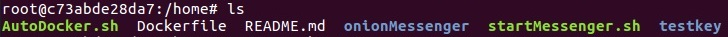
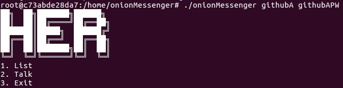

# HER Messenger - Team3

Onion Messenger - Team3 HER

### Abstract
- PGP를 이용한 암호화 메신저

### Installation
```sh
1. curl -fsSL https://get.docker.com/ | sudo sh   / 리눅스에 Docker 설치
2. docker version                                 / 사용자 Docker 그룹에 추가    
   * Client와 Server 정보가 정상 출력되면 설치 완료임 
   * Server 정보가 정상 출력되지 않으면? sudo usermod -a -G docker $[USER]
3. ./AutoDocker.sh                                / 설치한 Docker 확인  
4. 정상 설치 확인하기 : ls
   
5. cp ./testkey/* ./onionMessenger                / 테스트키 복사해서 넣기
6. cd onionMessenger                              / 폴더 변경하기
7. ./onionMessenger <githubID> <passPhrase>       / 로그인하기
       

```

### Usages
```sh
# ./startMessenger.sh
# ./onionMessenger/onionMessenger [githubID] [PassPhrase]
Done!
```

### Examples
- githubA user
```
# ./onionMessenger/onionMessenger githubA ???????
██╗  ██╗███████╗██████╗
██║  ██║██╔════╝██╔══██╗  
███████║█████╗  ██████╔╝  
██╔══██║██╔══╝  ██╔══██╗  
██║  ██║███████╗██║  ██║  
╚═╝  ╚═╝╚══════╝╚═╝  ╚═╝  
1. List
2. Talk
3. Exit
> 1  
 === Your List! ===
githubB : 172.17.0.2
 ==== Done! ====

1. List
2. Talk
3. Exit
> 2
                             ┌────────────────────────────┐                             
                             │ githubB                    │                             
                             │                            │                             
                             │                            │                             
                             │                            │                             
                             │                            │                             
                             │                            │                             
                             │                            │                             
                             │                            │                             
                             └────────────────────────────┘                             
Her                                                                                      
Me: hi                                                                                   
githubB: Hello                                                                           
Me: I am githubA                                                                         
githubB: i am github B~                                                                  
```

- github user
```
# ./onionMessenger/onionMessenger githubB ???????
██╗  ██╗███████╗██████╗
██║  ██║██╔════╝██╔══██╗
███████║█████╗  ██████╔╝
██╔══██║██╔══╝  ██╔══██╗
██║  ██║███████╗██║  ██║
╚═╝  ╚═╝╚══════╝╚═╝  ╚═╝
1. List
2. Talk
3. Exit
> 1
 === Your List! ===
githubA : 172.17.0.3
 ==== Done! ====

1. List
2. Talk
3. Exit
> 2

                             ┌────────────────────────────┐                             
                             │ githubA                    │                             
                             │                            │                             
                             │                            │                             
                             │                            │                             
                             │                            │                             
                             │                            │                             
                             │                            │                             
                             │                            │                             
                             └────────────────────────────┘                             

Her
githubA: hi
Me: Hello
githubA: I am githubA
Me: i am github B~
```

### Environment
- Git issue와 milestone을 사용하여 편한 의사소통 및 협업 가능
- JSON을 사용하여 빠르고 편한 파싱 및 헤더 구성
- ncurses를 이용한 보기 좋은 TUI환경 구성
- Qt Creator를 사용하여 Makefile의 자동 생성 및 편한 개발환경 구축


### Team member

| Team member     | Position | Assignment |
|:---------------:|:--------:|------------|
|  SeongIl Wi     |    TA    | Advice |
|  DongHyeon Oh   |   팀장   |HER messenger 개발 총괄|
|  SeungYeop Lee  |   팀원   |HER messenger 개발|
|  NakJun Choi    |   팀원   |PITCHME.md 작성, 홍보영상 편집, Presentation|
|  SeJin Jeong    |   팀원   |Sockthread.cpp 함수 개발, README.md 작성 |

### Insight

### Reference
 - https://github.com/nlohmann/json
